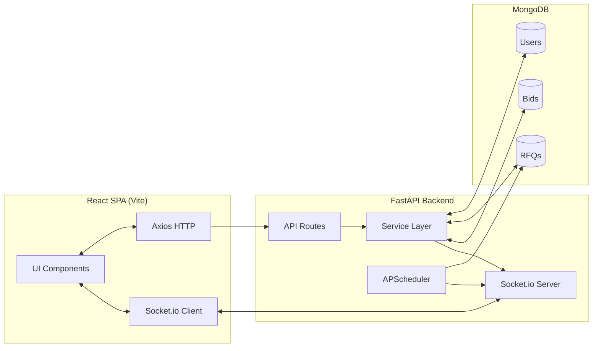
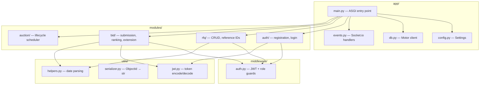
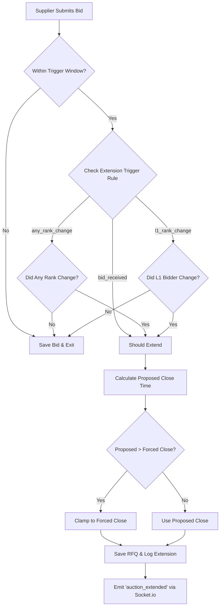
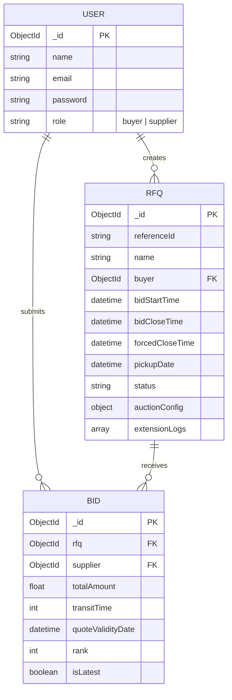

# High Level Design — AuctionX (British Auction RFQ System)

## System Overview

AuctionX is a real-time reverse-auction RFQ platform built with **React** and **FastAPI**. Buyers create RFQs with configurable start, close, and hard-stop (forced close) times, along with dynamic auction extension rules. Suppliers can view active RFQs and place bids in real time. The system auto-ranks bids, broadcasts updates to all observers via WebSockets, and conditionally extends deadlines when last-minute bids disrupt the leaderboard.

## Architecture Diagram

## Module Architecture

## Auction Extension Flow

## Database Entity-Relationship

