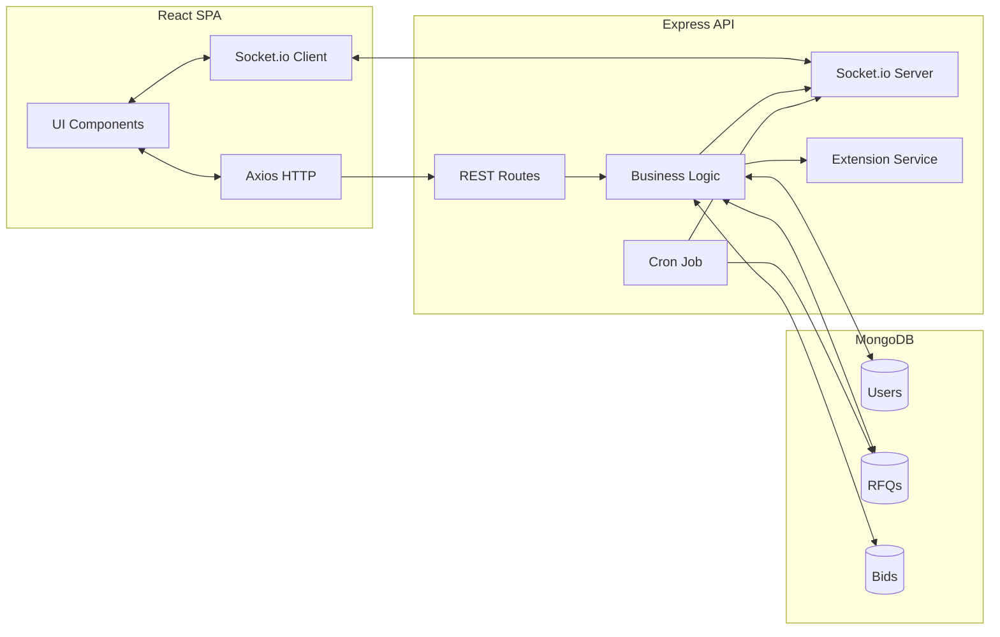
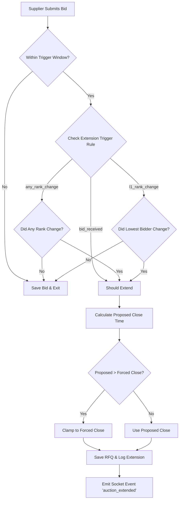
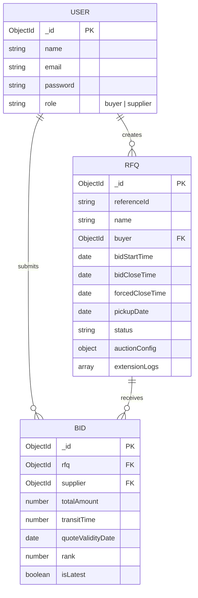

# High Level Design - British Auction RFQ System

## System Overview
The British Auction RFQ system is a MERN stack application designed to facilitate real-time, ascending-price (reverse context) bidding for freight requests. Buyers can create RFQs with specific start, close, and hard-stop (forced close) times, along with dynamic auction extension rules. Suppliers (carriers) can view active RFQs and place real-time bids. The system ensures fairness by auto-ranking bids, instantly broadcasting updates to all observers via WebSockets, and conditionally extending auction deadlines if last-minute bids disrupt the leaderboard (L1 rank changes, any rank changes, or simply bid receipt).

## Architecture Diagram

## Auction Extension Flow

## Database Entity-Relationship

